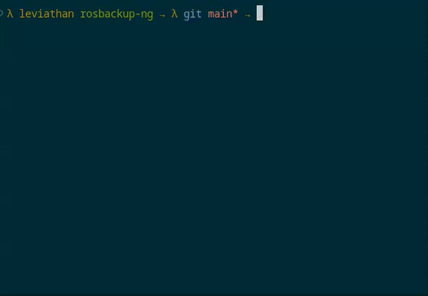

# RouterOS Backup NG

A powerful and flexible backup solution for MikroTik RouterOS devices. This tool automates the process of creating, managing, and storing both binary and plaintext backups of RouterOS configurations with support for parallel execution, encryption, and comprehensive system information collection.

## Demo


## Features

- **Multiple Backup Types**
  - Binary backups (`.backup`)
  - Plaintext exports (`.rsc`)
  - System information files (`.info`)

- **Advanced Backup Options**
  - Parallel backup execution
  - Backup encryption
  - Configurable retention periods
  - Compose-style visualization
  - Detailed logging
  - Tmpfs-based backup storage to reduce flash wear

- **Security Features**
  - SSH key-based authentication
  - Encrypted backups
  - Configurable SSH parameters
  - Host key verification

- **Storage Optimization**
  - Tmpfs-based temporary storage
  - Automatic tmpfs size calculation
  - Configurable fallback behavior
  - Flash wear reduction

- **Monitoring & Notifications**
  - Email notifications for backup status
  - Detailed logging with multiple levels
  - Real-time progress tracking

## Documentation

- [`doc/BOOTSTRAP.md`](doc/BOOTSTRAP.md) - Instructions for preparing RouterOS devices for automated backups using the bootstrap utility
- [`doc/COMMAND_REFERENCE.md`](doc/COMMAND_REFERENCE.md) - Complete reference of all command-line options for all scripts
- [`doc/CONFIG_REFERENCE.md`](doc/CONFIG_REFERENCE.md) - Detailed reference of all configuration parameters in global.yaml and targets.yaml
- [`doc/FILESYSTEM_STRUCTURE.md`](doc/FILESYSTEM_STRUCTURE.md) - Overview of the project's directory structure and organization
- [`doc/BACKUP_STRUCTURE.md`](doc/BACKUP_STRUCTURE.md) - Details about backup file formats, naming conventions, and information files
- [`doc/DESIGN_REFERENCE.md`](doc/DESIGN_REFERENCE.md) - Technical documentation about application architecture and development
- [`doc/TMPFS_FEATURES.md`](doc/TMPFS_FEATURES.md) - Documentation for tmpfs features

## Prerequisites

- Python 3.13.1 or higher
- RouterOS devices with SSH access enabled
- SSH key pair for authentication

## Installation

1. Clone the repository:
   ```bash
   git clone https://github.com/your-username/rosbackup-ng.git
   cd rosbackup-ng
   ```

2. Create and activate a virtual environment:
   ```bash
   python3 -m venv venv
   source venv/bin/activate
   ```

3. Install dependencies:
   ```bash
   pip install -r requirements.txt
   ```

4. Copy and configure sample configuration files:
   ```bash
   cp config/global.yaml.sample config/global.yaml
   cp config/targets.yaml.sample config/targets.yaml
   ```

## Configuration

### Global Configuration (global.yaml)

Here's a minimal [config/global.yaml](config/global.yaml.sample) to get you started. Check out [doc/CONFIG_REFERENCE.md](doc/CONFIG_REFERENCE.md) for more details.

```yaml
# Global configuration for RouterOS Backup NG

# Parent directory for storing backups (required)
backup_path_parent: backups

# Days to keep backups, -1 for infinite (optional, default: 90)
#backup_retention_days: 90

# Global backup password (optional)
backup_password: your-global-backup-password

# SSH settings
ssh:
  user: rosbackup            # Default SSH username (required)
  #timeout: 5                 # Connection timeout (optional, default: 5)
  #auth_timeout: 5            # Authentication timeout (optional, default: 5)
  #known_hosts_file: null     # Known hosts file path (optional)
  #add_target_host_key: true  # Auto-add target host keys (optional, default: true)

  # SSH connection arguments
  args:
    auth_timeout: 10          # SSH auth timeout (optional, default: 5)
    #keepalive_interval: 60   # Keepalive interval (optional, default: 60)
    #keepalive_countmax: 3    # Max failed keepalives (optional, default: 3)

# Temporary Storage Settings
use_tmpfs: true              # Use tmpfs for temporary storage (default: true)
tmpfs_fallback: true         # Fall back to EEPROM if tmpfs fails (default: true)
tmpfs_size: 50M              # Size of tmpfs in MB (optional, auto-calculated if not set)
```

### Target Configuration (targets.yaml)

Here's a minimal [config/targets.yaml](config/targets.yaml.sample) to get you started. Check out [doc/CONFIG_REFERENCE.md](doc/CONFIG_REFERENCE.md) for more details.

#### Basic Target
```yaml
targets:
  - name: ROUTER-1
    enabled: true
    host: 192.168.88.1
    ssh:
      private_key: ./ssh-keys/private/id_rosbackup
```

#### Advanced Target with Custom Settings
```yaml
targets:
  - name: ROUTER-2
    enabled: true
    host: 192.168.88.2
    ssh:
      port: 22
      user: rosbackup
      private_key: ./ssh-keys/private/id_rosbackup
      args:
        auth_timeout: 5
        channel_timeout: 5
        compress: true
    backup_password: CustomPassword  # Override global password
    backup_retention_days: 180       # Override global retention
    encrypted: true
    enable_binary_backup: true
    enable_plaintext_backup: true
    keep_binary_backup: true        # Keep binary backup on router
    keep_plaintext_backup: true     # Keep plaintext backup on router
    use_tmpfs: true
    tmpfs_fallback: true
    tmpfs_size: 25M          # Override global tmpfs size
```

#### Multiple Targets with Different Requirements
```yaml
targets:
  - name: CRITICAL-ROUTER
    enabled: true
    host: 10.0.0.1
    ssh:
      port: 22222  # Custom SSH port
      user: rosbackup
      private_key: ./ssh-keys/private/id_critical
    encrypted: true
    backup_retention_days: 365  # Keep backups for 1 year
    enable_binary_backup: true
    enable_plaintext_backup: true

  - name: BRANCH-ROUTER
    enabled: true
    host: 192.168.1.1
    ssh:
      port: 22
      user: rosbackup
      private_key: ./ssh-keys/private/id_branch
    encrypted: false
    enable_binary_backup: true
    enable_plaintext_backup: false  # Only binary backups

  - name: DEVELOPMENT-ROUTER
    enabled: false  # Disabled target
    host: 172.16.0.1
    ssh:
      port: 22
      user: rosbackup
      private_key: ./ssh-keys/private/id_dev
```

## Usage

### Basic Usage

```bash
# Run backup for all enabled targets
python3 rosbackup.py

# Run backup for specific target
python3 rosbackup.py --target ROUTER-1

# Enable compose-style output
python3 rosbackup.py --compose-style
```

### Compose-Style Output

The `--compose-style` flag provides a Docker Compose-like output format that shows real-time status of each backup operation:

```
[+] Executing backup for 3 targets ...

    ⠋ ROUTER-1             Running         2.5s
    ⠙ ROUTER-2             Waiting         0.0s
    ✔ ROUTER-3             Finished        5.2s

Summary:
    Total time: 7.8s
    Total size: 2.4MB
    Success: 3 | Failed: 0 | Total: 3
```



The compose-style output features:
- Real-time status updates with spinner animation
- Color-coded status indicators
- Clear success/failure markers
- Accurate backup size tracking
- Total execution time and summary statistics

### Dry Run Mode
```bash
./rosbackup.py --dry-run
```
```
01-06-2025 02:45:19 [INFO] [SYSTEM] Found 5 enabled target(s)
01-06-2025 02:45:19 [INFO] [SYSTEM] Running parallel backup with 5 workers
01-06-2025 02:45:19 [INFO] [SYSTEM] Backup completed: 5 succeeded, 0 failed
01-06-2025 02:45:19 [INFO] [SYSTEM] Backup completed. Success: 5, Failed: 0 [0m 0s]
```

### Specific Target Only
```bash
./rosbackup.py --target EDGE-ROUTER-38
```
```
01-05-2025 23:44:28 [INFO] [SYSTEM] Running backup for target: EDGE-ROUTER-38
01-05-2025 23:44:28 [INFO] [SYSTEM] Found 1 enabled target(s)
01-05-2025 23:44:31 [INFO] [EDGE-ROUTER-38] Binary backup file EDGE-ROUTER-38_7.15.3_arm64_01052025-234429.backup exists on the router.
01-05-2025 23:44:31 [INFO] [EDGE-ROUTER-38] Downloaded EDGE-ROUTER-38_7.15.3_arm64_01052025-234429.backup
01-05-2025 23:44:31 [INFO] [EDGE-ROUTER-38] Removed remote EDGE-ROUTER-38_7.15.3_arm64_01052025-234429.backup
01-05-2025 23:44:34 [INFO] [EDGE-ROUTER-38] Plaintext export saved on router as EDGE-ROUTER-38_7.15.3_arm64_01052025-234429.rsc
01-05-2025 23:44:34 [INFO] [EDGE-ROUTER-38] Plaintext backup saved as EDGE-ROUTER-38_7.15.3_arm64_01052025-234429.rsc
01-05-2025 23:44:34 [INFO] [SYSTEM] Backup completed. Success: 1, Failed: 0 [0m 6s]
```

### With Custom Log Level
```bash
./rosbackup.py --log-level DEBUG
```
```
01-05-2025 23:44:43 [DEBUG] [SYSTEM] Loaded global config: {'backup_path_parent': 'backups', ...}
01-05-2025 23:44:43 [INFO] [SYSTEM] Found 5 enabled target(s)
01-05-2025 23:44:43 [INFO] [SYSTEM] Running parallel backup with 5 workers
01-05-2025 23:44:43 [DEBUG] [HQ-ROUTER-01] Connecting to 192.168.100.128:22 as rosbackup
01-05-2025 23:44:43 [DEBUG] [BRANCH-ROUTER-14] Connecting to 192.168.100.233:22 as rosbackup
01-05-2025 23:44:44 [DEBUG] [HQ-ROUTER-01] SSH connection established with 192.168.100.128:22 using key-based authentication
01-05-2025 23:44:44 [DEBUG] [HQ-ROUTER-01] Connection secured with cipher aes128-ctr and MAC hmac-sha2-256
...
01-05-2025 23:44:50 [INFO] [SYSTEM] Backup completed. Success: 5, Failed: 0 [0m 7s]
```

### Without Parallel Execution
```bash
./rosbackup.py --no-parallel
```
```
01-05-2025 23:44:57 [INFO] [SYSTEM] Parallel execution disabled via CLI
01-05-2025 23:44:57 [INFO] [SYSTEM] Found 5 enabled target(s)
01-05-2025 23:44:57 [INFO] [SYSTEM] Running sequential backup
01-05-2025 23:45:00 [INFO] [HQ-ROUTER-01] Binary backup file MYR1_7.16.2_x86_64_01052025-234458.backup exists on the router.
01-05-2025 23:45:00 [INFO] [HQ-ROUTER-01] Downloaded MYR1_7.16.2_x86_64_01052025-234458.backup
01-05-2025 23:45:00 [INFO] [HQ-ROUTER-01] Removed remote MYR1_7.16.2_x86_64_01052025-234458.backup
01-05-2025 23:45:00 [INFO] [HQ-ROUTER-01] Plaintext backup saved as MYR1_7.16.2_x86_64_01052025-234458.rsc
...
01-05-2025 23:45:13 [INFO] [SYSTEM] Backup completed. Success: 5, Failed: 0 [0m 15s]
```

## Command Completion

For easier command-line usage, enable command completion for your current shell session:

```bash
source scripts/rosbackup-ng-completion.bash
```

This provides:
- Auto-completion for all command-line options
- File path completion for relevant options
- Target name completion from targets.yaml

The completion script supports both `rosbackup.py` and `bootstrap_router.py` commands.

For example, type `./rosbackup.py --` and press <kbd>Tab</kbd> to see all available options.

Or type `./bootstrap_router.py --host 192.168.1.1 --backup-user-` and press <kbd>Tab</kbd>.

## Error Handling

The tool implements comprehensive error handling for:
- SSH connection failures
- Authentication issues
- Insufficient permissions
- Backup creation failures
- File transfer problems
- Storage space issues
- Network connectivity problems

## Logging

Logs are stored in the specified log file (default: `rosbackup.log`) and include:
- Backup operations status
- SSH connection details
- Error messages and stack traces
- System information collection
- File transfer progress
- Cleanup operations

## Contributing

1. Fork the repository
2. Create your feature branch (`git checkout -b feature/AmazingFeature`)
3. Commit your changes (`git commit -m 'Add some AmazingFeature'`)
4. Push to the branch (`git push origin feature/AmazingFeature`)
5. Open a Pull Request

## License

This project is licensed under the MIT License - see the LICENSE file for details.

## Support

For support, please open an issue or send a PR :)
