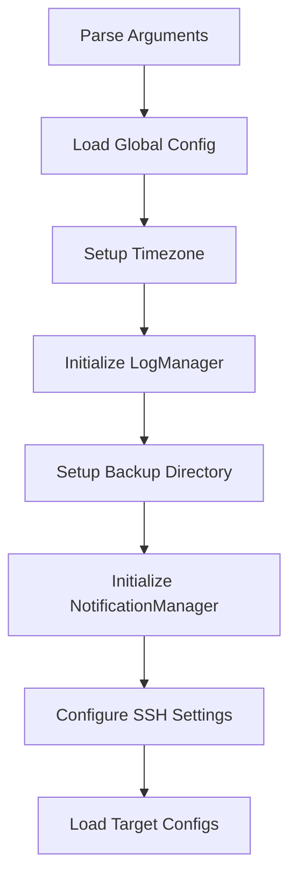
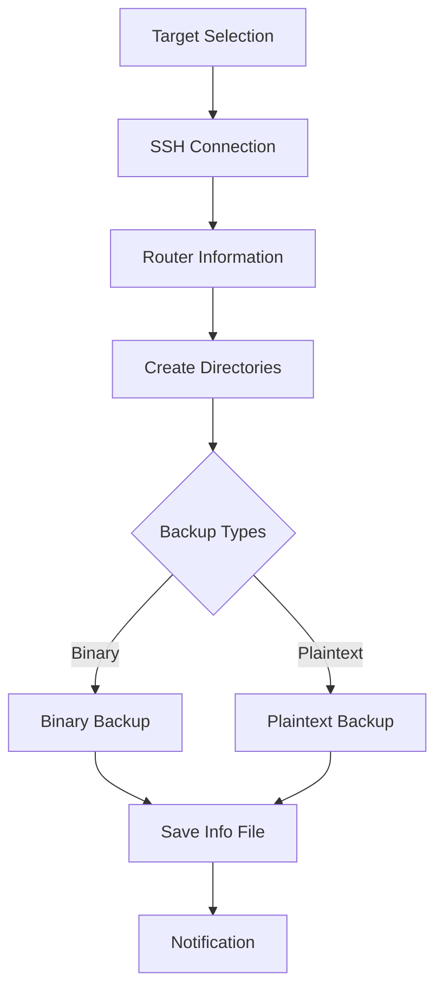
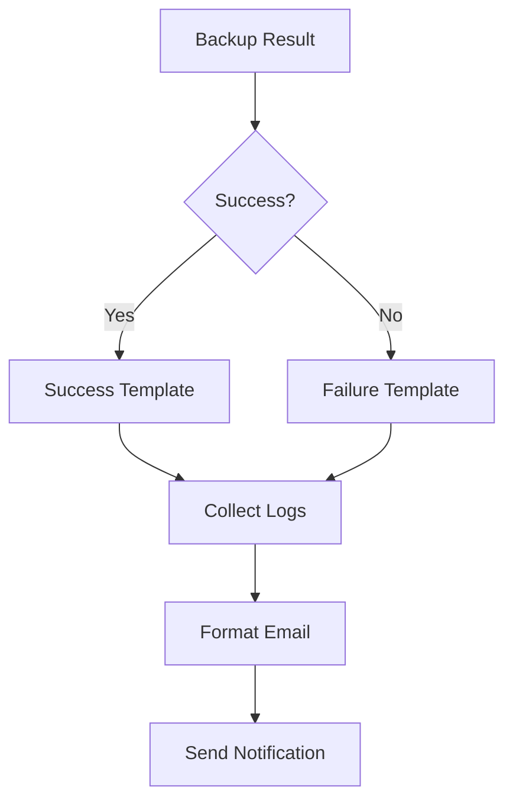
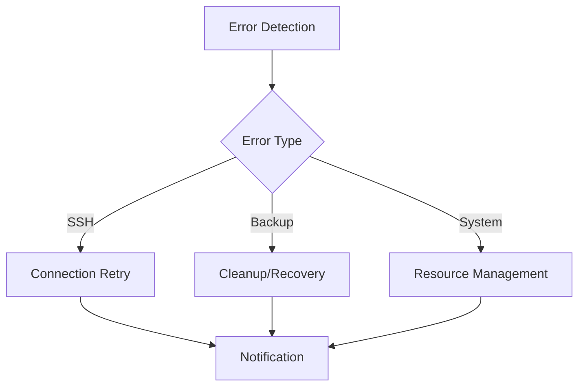

# Design Reference

## Architecture Overview

RouterOS Backup NG is designed with a modular architecture that separates concerns into specialized core modules. Each module is responsible for a specific aspect of the backup process, making the codebase maintainable and extensible.

## Component Flow

### 1. Initialization Flow



1. **Argument Parsing**
   - Parse CLI arguments for:
     - Config directory location
     - Log settings
     - Parallel execution options
     - Target selection
     - Dry run mode

2. **Configuration Loading**
   - Load `global.yaml`:
     - Backup path and password
     - SSH defaults
     - Notification settings
     - Timezone configuration
   - Load `targets.yaml`:
     - Target definitions
     - Per-target SSH settings
     - Backup preferences

3. **System Setup**
   - Configure timezone
   - Initialize logging system
   - Create backup directories
   - Setup notification handlers
   - Configure SSH parameters

### 2. Backup Process Flow



1. **Target Processing**
   - Filter enabled targets
   - Apply target-specific overrides
   - Prepare execution queue

2. **SSH Connection (`SSHManager`)**
   - Create SSH client
   - Configure connection parameters
   - Handle authentication
   - Manage connection lifecycle

3. **Router Information (`RouterInfoManager`)**
   - Gather system information
   - Parse hardware details
   - Collect performance metrics
   - Generate info file content

4. **Backup Creation (`BackupManager`)**
   - Binary backup:
     1. Check RouterOS version (≥7.7 required for tmpfs)
     2. If tmpfs enabled:
        - Calculate size based on memory if auto-sizing
        - Create tmpfs mount at configured mount point
        - Create backup in tmpfs
        - Download backup file
        - If keep_binary_backup=true, move to root storage
        - Clean up tmpfs
     3. If tmpfs disabled or fallback:
        - Create backup directly in root storage
        - Download backup file
     4. Verify backup integrity
     5. Apply encryption if enabled
   - Plaintext backup:
     1. Execute export command
     2. Process configuration
     3. Save to file
     4. Validate content
     5. Built-in 60-second timeout to prevent hanging operations

5. **File Management**
   - Create target directories
   - Generate filenames
   - Handle file permissions
   - Manage retention

### 3. Notification Flow



1. **Event Processing**
   - Determine notification trigger
   - Check notification preferences
   - Collect relevant logs

2. **Email Generation**
   - Select template
   - Format content
   - Attach logs
   - Add file information

3. **Delivery**
   - Connect to SMTP server
   - Send email
   - Handle delivery errors
   - Log notification status

### 4. Error Handling Flow



1. **Error Categories**
   - Connection errors
   - Authentication failures
   - Backup creation errors
   - File system issues
   - Resource problems

2. **Recovery Actions**
   - Connection retries
   - Resource cleanup
   - File system recovery
   - Error notification

3. **Logging**
   - Error details
   - Stack traces
   - Context information
   - Recovery attempts

## Backup Workflows

### 1. Binary Backup (.backup)

The binary backup process creates a full system backup file that can be used for complete system restoration.

#### File Paths and Storage
1. **Without tmpfs (--no-tmpfs)**
   - Backup file is created directly in router's root directory (`/`)
   - File naming: `/{identity}_{version}_{arch}_{timestamp}.backup`
   - Example: `/PNTY-VM2-R1_7.16.2_x86_64_01282025-014741.backup`

2. **With tmpfs (default)**
   - Backup file is initially created in `/rosbackup/` directory on tmpfs
   - File naming: `/rosbackup/{identity}_{version}_{arch}_{timestamp}.backup`
   - Example: `/rosbackup/PNTY-VM2-R1_7.16.2_x86_64_01282025-014741.backup`

#### Workflow Steps
1. **tmpfs Setup (if enabled)**
   - Calculate tmpfs size based on router's free memory
   - Create tmpfs with name `rosbackup` (this will automatically mount it under /rosbackup/)
   - Fall back to root storage if tmpfs fails and fallback is enabled

2. **Backup Creation**
   - Generate backup command with appropriate path
   - Add encryption if password is provided
   - Execute backup command
   - Verify backup file exists and has size
   - Download backup file using SCP

3. **Post-Backup Actions**
   - If `keep_binary_backup=true`:
     - Move file from tmpfs to root using `/file/set name=`
   - If `keep_binary_backup=false`:
     - Remove backup file from router

### 2. Plaintext Backup (.rsc)

The plaintext backup exports router configuration in RouterOS command format.

#### File Paths and Storage
1. **Without tmpfs (--no-tmpfs)**
   - Export file is created directly in root directory (`/`)
   - File naming: `/{identity}_{version}_{arch}_{timestamp}.rsc`
   - Example: `/PNTY-VM2-R1_7.16.2_x86_64_01282025-014741.rsc`

2. **With tmpfs (default)**
   - Export file is initially created in `/rosbackup/` directory on tmpfs
   - File naming: `/rosbackup/{identity}_{version}_{arch}_{timestamp}.rsc`
   - Example: `/rosbackup/PNTY-VM2-R1_7.16.2_x86_64_01282025-014741.rsc`

#### Workflow Steps
1. **Export Creation**
   - If `keep_plaintext_backup=true`:
     - Generate export command with file path
     - Execute export command
     - Verify export file exists
     - Download export file using SCP
   - If `keep_plaintext_backup=false`:
     - Execute export command without file
     - Stream output directly to local file

2. **Post-Export Actions**
   - If `keep_plaintext_backup=true`:
     - Move file from tmpfs to root using `/file/set name=`
   - If `keep_plaintext_backup=false`:
     - Remove export file from router

### 3. tmpfs Management

The tmpfs feature minimizes wear on the router's storage by using RAM for temporary file storage.

#### Setup
1. **Size Calculation**
   - For routers with ≥256MB free memory = Uses a fixed size of 50MB
   - For routers with <256MB free memory = Uses 1% of the available memory
   - Can be overridden with `tmpfs_size` in config
   - Minimum size: 5M
   - Maximum size: 50M

2. **Mount Process**
   ```routeros
   /disk/add type=tmpfs tmpfs-max-size=50M slot=rosbackup
   ```

3. **Cleanup Process**
   ```routeros
   /disk/remove [find slot=rosbackup]
   ```

#### Important Notes
1. **Single tmpfs Instance**
   - One tmpfs mount is used for both binary and plaintext backups
   - Created before first backup
   - Cleaned up after all backup operations complete
   - Must not be cleaned up between backups

2. **File Movement**
   - When keeping backups, files must be moved from tmpfs to root
   - Use `/file/set name=` command for moving
   - Example: `/file/set name="/backup.rsc" [find name="/rosbackup/backup.rsc"]`

3. **Error Handling**
   - If tmpfs creation fails and fallback is enabled, use root storage
   - If tmpfs creation fails and fallback is disabled, abort backup
   - Clean up tmpfs only after all operations complete
   - Failed tmpfs cleanup should not fail the backup

### 4. SCP File Transfer

The SCP transfer process handles downloading backup files from the router.

#### Important Notes
1. **Path Handling**
   - SCP supports paths with leading slash
   - Example: `/backup.rsc` or `/rosbackup/backup.rsc`

2. **Error Handling**
   - Verify file exists before transfer
     - E.g. `/file/print where name=` - if output returns a result, the file exists
     - Output of `/file/print where name=` also contains file size
   - Check file size after transfer
   - Clean up failed transfers
   - Log transfer errors with context

## Core Module Details

### BackupManager Class
```python
class BackupManager:
    def __init__(self, ssh_manager, router_info_manager, logger)
    def perform_binary_backup(self, ssh_client, router_info, ...)
    def perform_plaintext_backup(self, ssh_client, router_info, ...)
    def save_info_file(self, router_info, file_path, dry_run)
```

### SSHManager Class
```python
class SSHManager:
    def __init__(self, ssh_args, target_name)
    def create_client(self, host, port, username, key_path)
    def execute_command(self, client, command)
    def download_file(self, client, remote_path, local_path)
```

### RouterInfoManager Class
```python
class RouterInfoManager:
    def __init__(self, ssh_manager, target_name)
    def get_router_info(self, ssh_client)
    def parse_system_info(self, output)
    def parse_resource_info(self, output)
```

### NotificationManager Class
```python
class NotificationManager:
    def __init__(self, enabled, notify_on_failed, notify_on_success, smtp_config)
    def send_success_notification(self, target_name)
    def send_failure_notification(self, target_name, error_message)
    def format_email(self, template, context)
```

### LogManager Class
```python
class LogManager:
    def __init__(self)  # Singleton pattern
    def setup(self, log_level, log_file, use_colors)
    def get_logger(self, name, target_name)
    def set_log_level(self, level)
```

## Development Guidelines

### Code Organization
1. **Module Separation**
   - Keep modules focused and single-purpose
   - Use clear interfaces between modules
   - Maintain proper encapsulation

2. **Error Handling**
   - Use specific exception types
   - Implement proper cleanup
   - Provide meaningful error messages
   - Log appropriate context

3. **Configuration**
   - Use type hints for config structures
   - Validate all inputs
   - Provide sensible defaults
   - Document all options

4. **Testing**
   - Write comprehensive unit tests
   - Test error conditions
   - Mock external dependencies
   - Validate configuration parsing

### Best Practices
1. **Code Style**
   - Follow PEP 8
   - Use meaningful names
   - Document with docstrings
   - Keep functions focused

2. **Error Management**
   - Handle all error cases
   - Clean up resources
   - Log errors appropriately
   - Notify on failures

3. **Performance**
   - Use connection pooling
   - Implement parallel execution
   - Manage resource usage
   - Monitor execution time

4. **Security**
   - Use SSH key authentication
   - Implement encryption
   - Protect sensitive data
   - Validate inputs